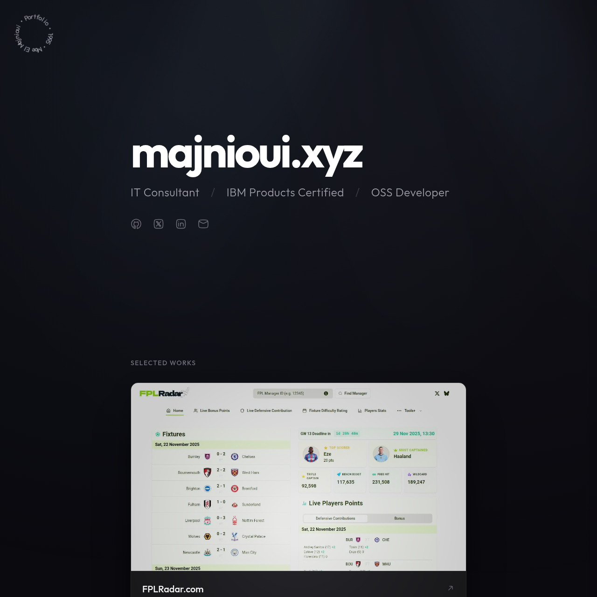

# OnePage Portfolio

A minimalist, professional portfolio website built with modern web technologies.

[](https://majnioui.me)

[**Visit Live Site**](https://majnioui.me)

## 🚀 Features

- **Minimalist Design**: Clean aesthetics with a focus on typography and spacing.
- **Responsive**: Fully responsive layout that works on all devices.
- **Fast Performance**: Built with Vite for lightning-fast development and production builds.
- **Modern Stack**: Utilizes the latest React features and TailwindCSS for styling.

## 🛠️ Tech Stack

- **[React](https://react.dev/)**: UI Library
- **[Vite](https://vitejs.dev/)**: Build Tool
- **[TailwindCSS](https://tailwindcss.com/)**: Utility-first CSS Framework
- **[Framer Motion](https://www.framer.com/motion/)**: Animations
- **[Bun](https://bun.sh/)**: JavaScript Runtime & Package Manager

## 📦 Getting Started

### Prerequisites

- [Bun](https://bun.sh/) (v1.0 or later)

### Installation

1. Clone the repository:
   ```bash
   git clone https://github.com/majnioui/OnePagePortfolio.git
   cd OnePagePortfolio
   ```

2. Install dependencies:
   ```bash
   bun install
   ```

### Usage

Start the development server:

```bash
bun dev
```

Build for production:

```bash
bun run build
```

Preview the production build:

```bash
bun run preview
```

## 📄 License

This project is open source and available under the [MIT License](LICENSE).
